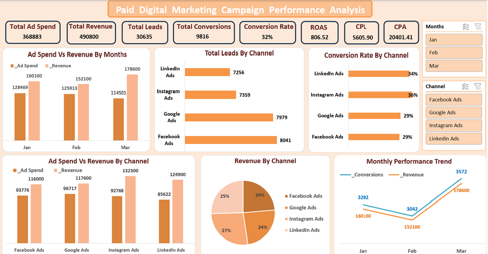

# Paid Marketing Campaign Performance Analysis Dashboard

## Project Overview
This project analyzes the performance of paid digital marketing campaigns across multiple advertising channels for marketing budget allocation.

## Objective
The goal of this project is to evaluate campaign performance and identify the most effective channels for marketing budget allocation.

## Dataset
The dataset contains paid marketing campaign data across multiple advertising channels including Facebook, Google, Instagram, and LinkedIn.

Key fields inculde:
- Ad spend
- Revenue
- Leads
- Conversions
- Date
- Channel

## Data Preparation
During the data preparation stage, additional marketing KPIs were created to evaluate campaign performance.

The following calculated columns were added:
- ROAS (Return on Ad Spend) = Revenue/Ad Spend
- CPL (Cost Per Lead) = Ad Spend/Leads
- CPA (Cost Per Acquisition) = Ad Spend/Conversions

## Tools Used
- Microsoft Excel
- Pivot Tables
- Data Visualization

## Key Metrics
- Ad Spend
- Revenue
- Leads
- Conversions
- Conversion Rate
- ROAS
- Cost Per Lead (CPL)
- Cost Per Acquisition (CPA)

## Business Questions
- Which advertising channel generates the most leads?
- Which channel generates the most revenue?
- Which platform has the highest conversion rate?
- Which platform has the lowest Cost Per Lead (CPL)?
- Which platform has the lowest Cost Per Acquisition (CPA)?
- Which channel provides the highest Return on Ad Spend (ROAS)?
- Which channel should receive more advertising budget?

## Key Insights
- Facebook Ads generated the highest number of leads, indicating strong performance in lead generation.
- Instagram Ads showed the highest conversion rate and generated the highest revenue.
- Facebook Ads showed the lowest Cost Per Lead (CPL).
- LinkedIn Ads demonstrated the lowest CPA and highest ROAS, suggesting the most efficient campaign performance.
- Based on efficiency and profitability metrics, LinkedIn Ads present the strongest case for increased advertising budget.

## Dashboard Preview
[] (Marketing_dashboard_image1.png)

